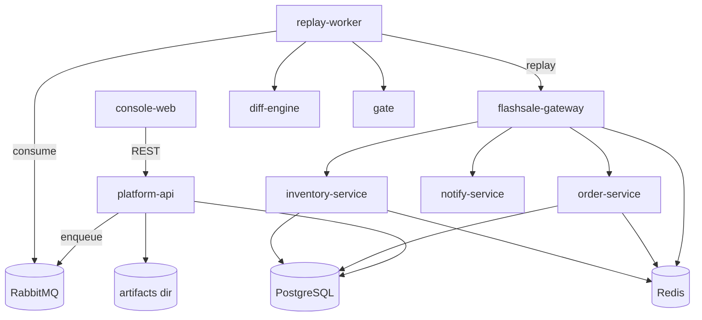

# ReplayGate Mono-Repo (Phase 1 MVP)

> 实现范围：FlashSale-Lite + ReplayGate平台 + Vue3控制台（P0/MVP）。

## 架构图



## 快速开始

1. 启动全部服务

```bash
docker compose up -d --build
```

2. 一键Demo（Windows PowerShell）

```powershell
powershell -ExecutionPolicy Bypass -File scripts\demo.ps1
```

3. 打开控制台

- Console: http://localhost:5173
- Platform API: http://localhost:8080

## Quick Demo

1. 启动核心服务（platform-api / diff-engine / gate / replay-worker / console-web）

```powershell
docker compose up -d --build platform-api diff-engine gate replay-worker console-web
```

2. 触发 FAIL（strict_tolerance 默认 0.05）

```powershell
powershell -ExecutionPolicy Bypass -File scripts\demo.ps1
```

3. 触发 PASS（strict_tolerance 调到 0.15）

```powershell
powershell -ExecutionPolicy Bypass -File scripts\demo.ps1 -StrictTolerance 0.15
```

说明：
- PASS/FAIL 由 `gate_verdict.json` 的 `reasons` 解释（`observed` vs `threshold`）。
- 每次 run 的产物目录在 `.\artifacts\<run_id>\`，可直接打开 JSON 查看。

## 一键 Demo 流程

脚本会自动执行：

1) 生成录制流量（recording_id=demo）
2) 创建run → replay-worker执行回放
3) Diff引擎计算差异 → Gate输出PASS/FAIL
4) 展示Artifacts并触发cleanup

## 如何制造 v1/v2 差异并触发 FAIL

`order-service` 内置版本差异：
- v1：按单价 100 计算
- v2：按单价 *1.1（+10%）计算

Diff规则中 `total_price` 为严格字段（strict），同时全局容忍度为 5%。
因此在创建run时：

- baseline_version = v1
- candidate_version = v2

会触发 `strict_mismatch` 并最终 FAIL。

## 端口清单

- 5173: console-web
- 8080: platform-api
- 8090: diff-engine
- 8091: gate
- 8000: flashsale-gateway
- 8001: order-service
- 8002: inventory-service
- 8003: notify-service
- 5432: PostgreSQL
- 6379: Redis
- 5672: RabbitMQ
- 15672: RabbitMQ 管理台

## Artifacts

每次 run 会生成目录：`.\artifacts\<run_id>\`

目录结构示例：

```
artifacts/
  <run_id>/
    diff_report.json
    gate_verdict.json
    replay_stats.json
    replay_log.txt
    cleanup_log.json
```

文件说明：
- diff_report.json：逐接口差异明细与聚合统计（diff summary）。
- gate_verdict.json：门禁最终结论与原因（source of truth）。
- replay_stats.json：回放统计（请求数、耗时、错误数等）。
- replay_log.txt：回放过程日志（worker 侧产出）。
（可选）cleanup_log.json：清理副作用的执行记录。

## 接口契约

- OpenAPI: `contracts/openapi.yaml`
- 前端类型：`console-web/src/types/api.ts`

## 关键能力（MVP）

- 回放请求注入 `X-Run-Id` / `X-Trace-Id`
- 服务端幂等：`Idempotency-Key` + Redis + DB 唯一约束
- cleanup API：`POST /runs/{id}/cleanup`
- Diff 规则：global ignore / endpoint rules / strict / schema breaking / 数值容忍
- Gate：输出 PASS/FAIL + reasons
- 前端：任务列表 / 创建任务 / 结果总览 / 报告与Diff链接
