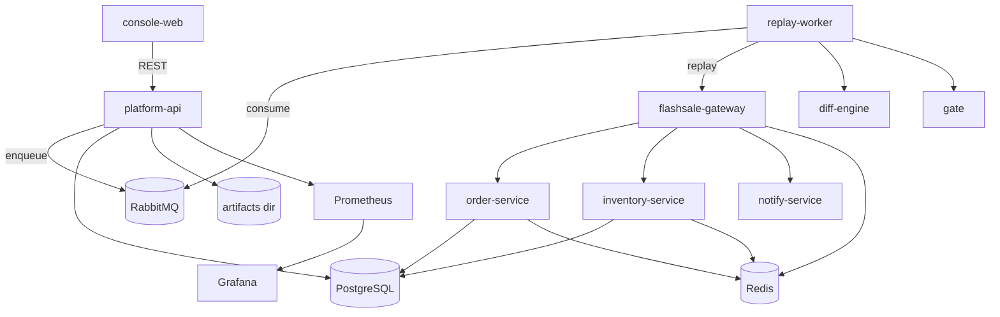

# ReplayGate Mono-Repo 

> FlashSale-Lite + ReplayGate 平台 + Vue3 控制台（Local + K8s 执行器）。

## 架构图



## 快速开始（Local）

1. 启动全部服务

```powershell
docker compose up -d --build
```

2. 一键 Demo（Windows PowerShell）

```powershell
powershell -ExecutionPolicy Bypass -File scripts\demo.ps1
```

3. 打开控制台

- Console: http://localhost:5173
- Platform API: http://localhost:8080

## Quick Demo（Local）

1. 启动核心服务（platform-api / diff-engine / gate / replay-worker / console-web / prometheus / grafana）

```powershell
docker compose up -d --build
```

2. 触发 FAIL（strict_tolerance 默认 0.05）

```powershell
powershell -ExecutionPolicy Bypass -File scripts\demo.ps1
```

3. 触发 PASS（strict_tolerance 调到 0.15）

```powershell
powershell -ExecutionPolicy Bypass -File scripts\demo.ps1 -StrictTolerance 0.15
```

说明：
- PASS/FAIL 由 `gate_verdict.json` 的 `reasons` 解释（`observed` vs `threshold`）。
- 每次 run 的产物目录在 `\artifacts\<run_id>\`，可直接打开 JSON 查看。
- `\artifacts\index.html` 提供聚合入口。

## Quick Demo（K8s 执行器）

1. 启动 kind 并加载 runner job 镜像

```powershell
powershell -ExecutionPolicy Bypass -File scripts\kind-up.ps1
```

2. 设置 K8s 环境并启动服务

```powershell
$env:ENABLE_K8S_EXECUTOR="true"
$env:K8S_NAMESPACE="replaygate"
$env:K8S_GATEWAY_URL="http://host.docker.internal:8000"
$env:K8S_DIFF_ENGINE_URL="http://host.docker.internal:8090"
$env:K8S_GATE_URL="http://host.docker.internal:8091"
$env:K8S_PERF_RUNNER_URL="http://host.docker.internal:8093"
$env:K8S_ARTIFACTS_HOST_PATH="/artifacts"
docker compose up -d --build
```

3. 在控制台创建 Run，选择执行器为 `k8s` 并勾选 `replay, perf`。

## 一键 Demo 流程

脚本会自动执行：

1) 生成录制流量（recording_id=demo）
2) 创建 run → replay-worker 执行回放
3) Diff 引擎计算差异 → Gate 输出 PASS/FAIL
4) 展示 Artifacts（平台自动 cleanup）

## 如何制造 v1/v2 差异并触发 FAIL

`order-service` 内置版本差异：
- v1：按单价 100 计算
- v2：按单价 *1.1（+10%）计算

Diff 规则中 `total_price` 为严格字段（strict），同时全局容忍度为 5%。
因此在创建 run 时：

- baseline_version = v1
- candidate_version = v2

会触发 `strict_mismatch` 并最终 FAIL。

## 端口清单

- 5173: console-web
- 8080: platform-api
- 8090: diff-engine
- 8091: gate
- 9090: prometheus
- 3000: grafana
- 8000: flashsale-gateway
- 8001: order-service
- 8002: inventory-service
- 8003: notify-service
- 5432: PostgreSQL
- 6379: Redis
- 5672: RabbitMQ
- 15672: RabbitMQ 管理台

## Artifacts

每次 run 会生成目录：`\artifacts\<run_id>\`

目录结构示例：

```
artifacts/
  <run_id>/
    diff_report.json
    gate_verdict.json
    replay_stats.json
    replay_log.txt
    cleanup_log.json
    perf_report.json
    perf_summary.json
    security_report.json
    compat_report.json
    obs_report.json
```

文件说明：
- diff_report.json：逐接口差异明细与聚合统计（diff summary）。
- gate_verdict.json：门禁最终结论与原因（source of truth）。
- replay_stats.json：回放统计（请求数、耗时、错误数等）。
- replay_log.txt：回放过程日志（worker 侧产出）。
- perf_report.json：性能门禁结果与摘要。
- security_report.json：安全扫描摘要。
- compat_report.json：API schema 兼容性结果。
- obs_report.json：可观测门禁结果（error_rate / p99）。
- cleanup_log.json：清理副作用的执行记录。

## 可观测性

- /metrics：Platform 暴露 Prometheus 指标（replay_requests_total / replay_errors_total / run_error_rate / run_rps / run_latency_ms_*）
- Prometheus: http://localhost:9090
- Grafana: http://localhost:3000（admin/admin）

## 接口契约

- OpenAPI: `contracts/openapi.yaml`
- 前端类型：`console-web/src/types/api.ts`

## Troubleshooting

- console-web 无法访问：确认 `docker compose ps` 中 console-web 为 Running。
- K8s executor 失败：确认 kind 运行、job 镜像已加载、`host.docker.internal` 可用。
- /metrics 无数据：先跑一次 demo，确保 run 已完成并产出 replay/perf 结果。

## Design Notes

- Local vs K8s：Local 执行器直接在 worker 内运行 runner；K8s 执行器将 replay/perf 作为 Job 运行，结果回写到 artifacts。
- 门禁聚合策略：任一 runner FAIL => overall FAIL；每个 runner 输出 reasons（observed vs threshold）。
- 可观测门禁：obs runner 基于 perf_report.json 评估 error_rate 与 p99。
